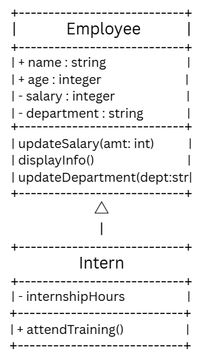

# Advanced Class Relationships

## Previous Activities
[classAttrib](classAttributesMethods.md)
[classRel](classRelationships.md)

## Existing System Description:

## Inheritance Relationship

Parent: Employee

Child: Intern

Explanation: An intern is a special type of employee. The word employee is an umbrella term for different types of workers (Can be depending on pay, hierarchy, etc.). The employee class has attributes like name and department, and so does the intern. However, the intern has attributes unique to itself, like internship hours.

## Inheritance UML

## Composition/Aggregation
Relationship: Aggregation
Explanation: The relationship between an Employee and a Supervisor is an Aggregation relationship. This is because employees and supervisors may exist independently of each other. Both are optional to each other.

## Advanced UML Diagram

## Python Implementation
[Source Code](advancedRelationships.py)

## Test Run

## Object Diagram

## Reflection
1. Why did you choose your inheritance relationship? Explain why your child class is a type of your parent class.
- I chose Intern because it is a specialized type of worker. The intern and employee classes share many attributes, but interns possess their own unique attributes.
2. How did inheritance reduce duplicate code? Identify attributes or methods that were reused.
- By using inheritance, I did not need to rewrite the attributes of the employee into the intern class.
3. Why is your HAS-A relationship Composition or Aggregation? Explain the life cycle relationship between the two objects.
- The relationship is Aggregation. The connection between my two objects, the Supervisor and the Employee, has a weak HAS-A link. The supervisor and employee can exists independendtly. The supervisor may oversee multiple employees, but an employee can have only one supervisor.
4. What is the difference between Association from Part III and the advanced relationship you implemented?
- The difference is, 
5. How does your design follow the DRY principle?
- My design follows the DRY (Don't Repeat Yourself) principle because it utilizes inheritance in order to avoid redundancy with classes, attributes, and methods.