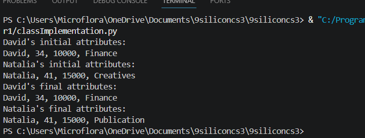
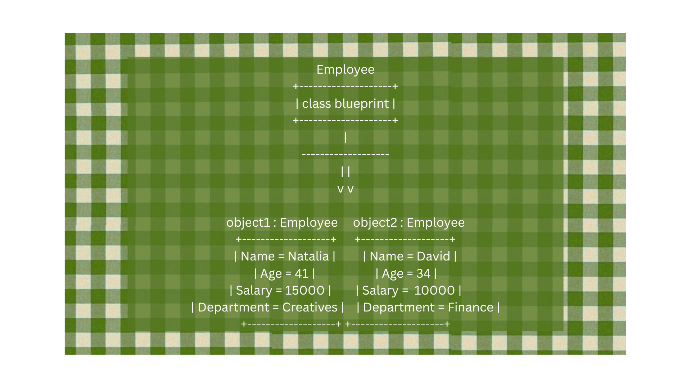

# Class Attributes and Methods

## Previous Design
Link to my previous activity:
[Class Object UML](quarter1/classObjectUML.md)

## Design Revision
There were no revisions made to the previous UML.

## Visibility Decisions
|  Attribute | Data Type | Visibility |                     Why Public/Private?                  |
| ---------- | --------- | ---------- | -------------------------------------------------------- |
| Name       | string    | public     | others may view the employee's name                      |
| Age        | integer   | public     | others may view the employee's age                       |
| Salary     | integer   | private    | others must not be permitted to view or alter the salary |
| Department | string    | private    | others must not be permitted to alter the department     |

## Updated UML Class Diagram

## Python Implementation
[View Python Source](quarter1/classImplementation.py)

## Test Run

## Object Diagram

## Analysis

### 1. Why did you make your chosen attribute private? Explain what could go wrong if other parts of the program changed it directly.
I made the object's salary and department private so that they are not able to be modified by external methods and hide unnecessary data when needed. However, bugs may appear if the attribute is modified.

### 2. Which method changes the state of your object? Identify the attribute affected and describe what happens.
Two methods alter two different attributes of the object: updateSalary which updates the salary, and updateDepartment which updates the object's department. These methods simply alter the value of the attributes.

### 3. How did your two objects demonstrate that instances are independent? Refer to your actual test output.
I altered the "Department" attribute for my second object, and the "Department" attribute of my first object was left unchanged. The screenshot of my actual test output proves this.

### 4. What is the difference between your class diagram and your object diagram? Explain this using your own class.
The class diagram shows the general blueprint of the class. Meanwhile, the object diagram is an example application and usage of the classes with different values.
