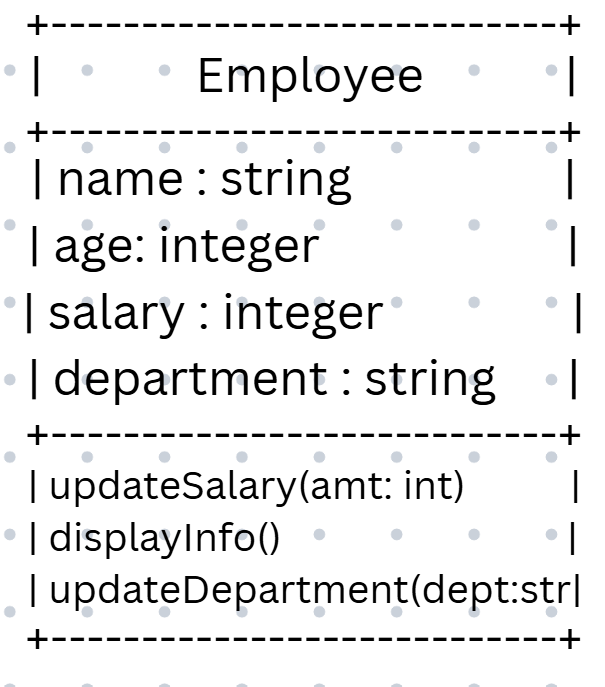

# SG4 - Understanding Classes and Objects
## Class Name - Employee
## Class Description - This class is a representation of a corporate employee.

## Properties
|  Property  | Data Type |        Description        |
| ---------- | --------- | ------------------------- |
| Name       | string    | employee's name           |
| Age        | integer   | employee's age            |
| Salary     | integer   | employee's monthly salary |
| Department | string    | employee's department     |

## Methods
|            Method             |          Description          |
| ----------------------------- | ----------------------------- |
| updateSalary(amt: int)        | updates employee's salary     |
| displayInfo()                 | displays employee's info      |
| updateDeparment(dept: string) | updates employee's department |

## Class Diagram

## Design Explanation
### Why did you choose this class?
I figured it would be easy to use polymorphism on this class, in case it is needed for future activities.

### Which property is the most important? Why?
I think the most important attribute would be the salary of the employee. An employee's salary is one of its main defining attributes that sets it apart from other classes, and is therefore unique to the employee class.

### Which method is the most useful? Why?
I think the most useful method would be the displayInfo(). I think this method is also useful for other classes. When a user makes use of a class in a program, the tendency is, they will use the displayInfo() method a lot, especially after updating the attributes of the class.

## Design Revision
No major changes were needed from my original design.